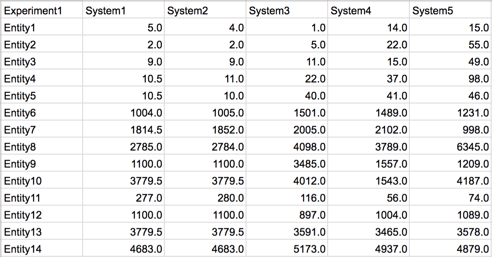
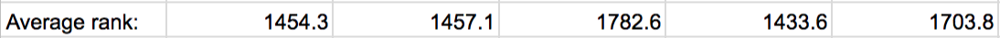
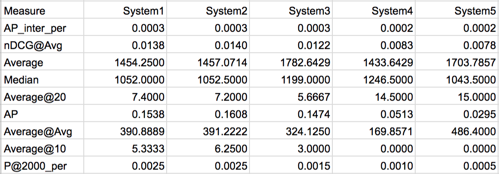
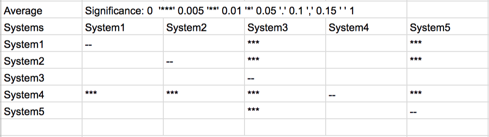

# Ranking Evaluation Tool
A script for evaluating the stability and sensitivity (or discriminative power) of the most common information retrieval evaluation measures such as "average precision" (AP), "normalised discounted cumulative gain" (nDCG), etc., when unlabelled test data is used to evaluate ranking systems. This tool also computes significance values when comparing performance differences between ranking systems.

### Background information

###### The typical application scenario
Let us say that you are comparing different ranking systems for the same task. These can be different ranking algorithms or classification tasks that produce lists of ranked results. You typically want to evaluate the performance of the different ranking systems with appropriate test data.

The test data are entities that are considered relevant (or important) but other than that nothing is known about them (i.e., they are not ranked or labelled). The assumption is that the higher these relevant entities are ranked by an algorithm, the better the performance of the algorithm. For normal search results one can simply use one of the standard evaluation measures such as Average Precision (AP or AP@10) or Mean Average Precision (MAP@10) without loosing any sleep about the validity of the results.

However, what if the rank distribution of the relevant test entities is very sparse and skewed? What if the the ranks are very low (high value in the hundredth or 10-thousands)? Are the standard evaluation measures appropriate for evaluating the ranking algorithms?

With this tool you can compute the sensitivity of evaluation measures (how well do they differentiate between significant and insignificant differences between the ranking distributions of your ranking systems). You can also compute the stability of the evaluation measures (how volatile is an evaluation measure under changing conditions when evaluating your ranking systems).

Once you identified the most appropriate evaluation measure for your experiment, you can use this tool to evaluate your ranking systems to see which ranking systems are significantly better in ranking the relevant entities than others.

###### Evaluating the evaluation measures
The basic idea behind the evaluation of the evaluation measures is the splitting the test data into different *queries* (groups) and observing performance differences of an evaluation measure between the ranking systems in an experiment.

Assume *r* relevant entities are split into 10 queries to construct a *query set*. The queries are constructed by sampling without replacement from the *r* entities. Therefore, each query consists of *r*/10 entities, where each entity is used exactly once. We also have to define a *fuzziness* (or significance) value.

Three measures can be computed for the "performance" (or "appropriateness") of evaluation measures *M*:
1. **Error Rate:** For each pair of ranking system *(A,B)* and measure *M* over a query set *Q*, the number of times that *M* scored *A* better than, worse than, or equal to *B* is counted. The performance of *A* and *B* is considered equal if the percentage difference between two scores is smaller than the *fuzziness* value. For comparing *A* to *B* the correct answer is considered to be the larger count of better-than and worse-than values. The smaller count is therefore the number of times a result of *M* was incorrect. The **error rate** is therefore the total error counts across all *(A,B)* pairs divided by total number of comparisons. Intuitively, the error rate can be interpreted as the percentage of time a measure comes to the wrong decision when evaluating the ranking systems. It therefore indicates a lack of stability of an evaluation measure.
2. **Tie Rate:** Similar to the description of the error rate, the tie rate is based on the count of the number of times the scores computed by *M* for a query between two systems *(A,B)* were considered equal given the *fuzziness* value. The tie rate is the average percentage of the number of times a measure could not decide which of two systems was better. It therefore indicates a lack of sensitivity or lack of discriminative power.
3. **ASL Rate:** The Achieved Significance Level (ASL) signifies the sensitivity of evaluation measures and uses a paired bootstrap hypothesis test. It is based on the same underlying idea of quantifying the differences of performance distributions and counting the number of times an evaluation measure produced significantly different performance distributions based on varying query sets. The main difference to the error rate approach is that the bootstrap query sets are created by sampling with replacement from the set of queries.

For details see Section 5 in [Dunaiski et al. (2018)](https://doi.org/10.1016/j.joi.2018.06.002).

###### Evaluating the ranking systems
Two approaches can be used to compute estimated performance differences that are required between the actual ranking systems:
1. Performance differences are estimated using the paired bootstrap hypothesis tests directly. For details see [Sakai (2006)](https://doi.org/10.1145/1148170.1148261).
2. Using the **swap method** to estimate the require performance differences. In this implementation we compute the swap rates using the bootstrapped query sets (creating query sets by resampling from the initial query set). For details see Section 5 in [Dunaiski et al. (2018)](https://doi.org/10.1016/j.joi.2018.06.002).

### Usage
This tool should run out of the box (Python 2.7) given that all python dependencies are installed.

###### Input data
The input is a tab separated file containing the ranks of the relevant entities of the test data. The first column has to contain unique entity identifiers and all following columns consist of the actual rank values (can contain fractional ranks). The first row must contain unique identifier of the ranking system that produced the corresponding ranks. Also, it is assumed that the rank values start with 1 and not 0.

Small example of made-up ranks for 5 ranking systems where only 14 test data entities are used:


From this example you can see that the ranking system have ranked the 14 test entities relatively equally and it is not obvious which system is the best. For example, the average ranks produced by the five systems are relatively close together:


However, System3 ranks Entity1 in position 1 while the other systems assign lower ranks.

**Note:** a minimum number of entities is required to compute accurate and stable results. The split count (number of queries) should ideally be more than 10 and the number of entities per query should ideally be be more than 20. This means that 200 test data points are already required. However, the stability of the results also depends on the evaluation measures used and the rank distributions that are analysed. For some evaluation measures and rank distributions it might very well be that a query count of 5 with 10 test entities each is sufficient. In general, the more sparse and skewed the rank distributions are the more test data entities are required.

###### Executing the tool:
To execute the tool with default parameter only the input file is required. You can used ```stdin``` or the ```-f``` option:
```
python RankingEvaluation.py -f testranks.txt
```

###### General options
 - ```-h, --help``` prints the help information.
 - ```-v, --verbose``` prints some additional information to the screen.
 - ```-s, --seed``` specifies the seed for randomization (default: ```None```).
 - ```-t, --threads``` specifies the number of threads that should be used (default: ```1```).
 - ```-f, --file``` to specify the file that contains the ranks of the systems that are evaluated (default: ```stdin```).
 - ```-o, --out``` to specify the file to which the results should be written (default: ```stdout```).
 - ```-p, --printing``` can be used to specify what results should be printed/computed (default: ```all```). See Section *Output* below for more information.

###### Experiment parameters
- ```-i, --iter``` is the number of iterations over which the results are averaged (default: ```50```).
- ``` -b --boot``` specifies the number of bootstrap samples used (default: ```1000```).
- ```-e, --err``` if the error and tie rates should also be computed which are listed in the evaluation results.
- ```-w, --swap``` is a flag to specify that the *swap method* should be used to compute significance values instead of the default *bootstrap test* difference estimation.
- ```-n, --totalranks``` specifies the total number of entities that are ranked by the systems. This parameter is required by methods that convert standard ranks into percentile or permille rankings. It should be noted that this parameter value should not be the number of test data entities in an experiment but the total number of entities that the ranking systems ranked.

###### Experiment range parameters
The range parameters are used to analyse the behaviour of the evaluation measures under changing conditions. A separate evaluation is computed for each combination of the range parameters listed below. The results are written to the output file (one evaluation per line).
- ```--cutoffs``` a list of cutoff values (default: ```None```)
- ```--sigs``` specifies the significance values that should be used during the evaluation of the evaluation measures and for comparing the ranking systems (default: ```0.005 0.01 0.05 0.1 0.15```).
- ```--splits``` list of values that specifies the number of queries used in the evaluation (default: ```10```). Say, ```--splits 5 10``` is specified, then the evaluation measures are evaluated twice, where the test data is split into 5 and 10 queries, respectively.
- ```--systems``` list of values that specifies the number of ranking systems used per evaluation (default uses all). The ranking systems are randomly drawn from all system in an experiment. Say you are evaluating 10 ranking systems and specify ```--systems 7 8```, then two evaluation experiments are executed where first 7 ranking systems are randomly chosen and then 8 again for a separate experiment.
- ```--entities``` is a list of the number of test entities that are used in an experiment (default uses all). The values specified here are the numbers of test data entities that are randomly drawn from all entities for an experiment.

###### Specifying the evaluation measures
In the file ```RankingEvaluation.py``` the method ```getEvaluationMethods()``` returns a dictionary containing the evaluation measures that should be used in an experiment. The keys in the dictionary have to be unique names for the corresponding evaluation measure. The values in the dictionary are tuples of the format ```(function, cutoff, requiresTotalRanks)``` where:
- ```function``` is the method of the evaluation measure that should be used.
- ```cutoff``` should be ```None```, if the corresponding evaluation measure does not use cut-offs, or a positive numerical value that specifies the cut-off rank. Alternatively, ```cutoff``` can be set to ```True``` if the corresponding evaluation measure should be computed with each of the cutoff values specified in the parameter range (```--cutoffs```) in the experiment.
- if ```requiresTotalRanks``` is set to ```True``` then the ```--totalranks``` parameter is required to compute this evaluation measure. This is only required for evaluation measures that compute percentile or permille rankings.

Example:
```
import EvaluationMeasures as ms
def getEvaluationMethods():
    return {
        'AP' : (ms.AP, None, False),
        'Average@10' : (ms.Average_at_k, 10, False),
        'Average@k' : (ms.Average_at_k, True, False),
        'nDCG@Avg_permille' : (ms.NDCG_at_n_bucket, None, True)
    }
```
In the above example, four evaluation measures are specified. The name of the first measure is ```AP``` whose implementation is the method ```ms.AP``` and should not be computed with a cut-off. The second method, ```ms.Average_at_k```, is defined with a static cut-off value of 10. Even if additional cut-off values are defined in an experiment, this measure will always be computed with a cut-off rank of 10. The third measure sets the ```cutoff``` parameter to ```True``` which means that the parameter range specified by ```--cutoffs``` is used. Lastly, the measure ```nDCG@Avg_permille``` should be computed without a cutoff but requires the parameter ```--totalranks``` to be specified.

###### Implementing custom evaluation measures
Additional custom evaluation measures can be implemented in the ```EvaluationMeasures.py``` file and have to adhere to the same convention as above: ```methodFunction(sortedRanks, cutoff, totalRanks)```.

The method implementation of an evaluation measure has to return a tuple ```(result, count)``` where ```result``` is the actual evaluation score and ```count``` is the number of entities used for its computation of the score.
Below is the implementation example of the measure *Average@k* which computes the average rank of the test entities up to a cut-off level ```k```:
```
def Average_at_k(sortedRanks, k, totalRanks=None):
    count = 0
    sum_ = 0
    for rank in sorted_ranks:
        if rank <= k:
            count += 1
            sum_ += rank
        else:
            break
    if count == 0:
        return (np.NaN, 0)
    return (sum_ / count, count)
```
Note that the ranks of the test entities will always be passed to the evaluation methods in a sorted list (ascending rank values).

### Output
The tool produces four different outputs:
1. ```--printing eval``` computes the evaluation results of the evaluation methods such as the *error*, *asl* and *tie rates*.
2. ```--printing actual``` computes the actual performance values of the ranking system for each evaluation measure that is specified.
3. ```--printing sign``` prints the significance values. A matrix with associated significance values is printed where a significance values signifies that the system of the row is significantly better than the system of the column.
4. ```--printing all``` prints are the results: the evaluation results, the actual system performances, and the significance values matrices.

The tool was executed with the following options to produce the results that are discussed here where the file ```testranks.txt``` contains the ranks from the table in the previous section.
```
python RankingEvaluation.py -f testranks.txt --boot 1000 --iter 50 --threads 12 --splits 2 --seed 1 --printing all -n 100000
```
The table below shows the output of the actual system performances for various evaluation measures. Looking at the *Average* row, you will see that those values correspond to the values in the table above.


The table below shows the significance results of the Average Rank measure on the example ranks above:

From this table, one can see that System 4 is signifcantly better than all other systems. It should be noted that for these results only 2 queries were used (```--splits 2```) and therefore the results are rather unreliable. Therefore, this evaluation should only be used if enough test data is available and after analysing the stability of the evaluations measures under changing experiment parameters.

##### Interpreting the evaluation results
The table for the evaluation results has too many columns to show in an image. Each row in these results corresponds to one experiment and lists the following information:

Below is a description of each column in the evaluation results section and how the corresponding values should be interpreted:
- **method**: the name of the evaluation measure. This is a unique name of the evaluation measure which is a string that concatenates the evaluation measure's name and optionally the used cut-off value (```<methodName>_<cutoff>```) if an experiment is conducted with various cut-off values from a parameter range. Example: ```AP@n_10```.
- **norm**: the canonical name of the evaluation measure as specified by the user. Example: ```AP@n```.
- **correlation**: the average spearman rank correlation between the queries (sampled without replacement) used during the number of iterations. It has no significant meaning for the evaluation of the evaluation measures and is only printed for informational purposes.
- **stddev corr**: the standard deviation of **correlations**.
- **systemCount**: displays the number of systems used for this evaluation.
- **splitCount**: displays the number of queries used for the corresponding evaluation.
- **entityCount**: displays the number of entities sampled for this evaluation.
- **fuzziness**: displays the significance value used for the corresponding evaluation.
- **cutoff**: displays the rank cut-off value used by the evaluation measure for this evaluation.
- **errRate**: the error rate. A value between 0 and 50 where 0 signifies no errors and 50 signifies that the corresponding evaluation measure came to the wrong conclusion for every decision. A value above 25 should be considered bad signifying a high probability of the corresponding evaluation measure being unable to consistently identify the better of two ranking systems.
- **stddev errRate**: the standard deviation of the **errRate** over the number of iterations computed in an experiment.
- **tieRate**: the tie rate is the average percentage of the number of times a measure could not decide which of two systems was better given the corresponding **fuzziness** value. It takes on a value between 0 and 100. The tie rate has to be considered together with the **errRate** when judging the effectiveness of evaluation measures. For example, a measure might have a very low error and tie rate, which indicates that the measure has high stability and good discriminative power. The two values can also diverge where a measure can have a low error rate but a high tie rate, indicating that the measure has low discriminative power (high tie rate) but that the few remaining decisions were decided mostly correctly
- **tRate**: the t-test when comparing query rank distributions. This is similar to the ASL rate except no bootstrapping is used (queries are sampled without replacement). It should be noted that the results are often quite unstable.
- **relRate**: the average percentage of the number of entities used by the corresponding evaluation measure to compute performance scores. A value of 90 indicates that the evaluation measure, on average, used 90% of the test entities for computing the performance score.
- **asl**: the ASL of the corresponding evaluation measure. The ASL is the rate of a measure's sensitivity to detect significant differences between the rankings of the systems. Given a fuzziness value of 0.05 and an ASL rate of 80 for a measure *M*, we can be 95% confident that *M* identifies differences in rankings 80% of the time.
- **estDiff**: is the minimum difference in the performance score required to conclude that two systems in the experiment are significantly different. The significance level is the corresponding **fuzziness** value. Say that fuzziness is 0.05 and **estDiff** is 4.3, then if two system performances differ by more than 4.3, we can conclude with 95% "confidence" that the one system performs better than the other.
- **swapDiffMin**: similar to **estDiff** except that the *swap method* is used. **swapDiffMin** is the lower bound of the estimated required difference.
- **swapDiffMax**: the upper bound of the required difference computed by the *swap method*.
- **decisions**: the actual performance values of the corresponding **method** when all test entities are used and not split into separate queries.

### Summary: typical work flow for an experiment
1. First evaluate the evaluation measures on their stability and sensitivity using the ranks of your test data.
``python RankingEvaluation.py --printing eval --splits <> --entities <> --systems <>``

2. After analysing the results and identifying the most stable evaluation measure and appropriate parameters, the ranking systems can be evaluated. ``python RankingEvaluation.py --printing sign --splits <> --entities <> --systems <>`` and ``python RankingEvaluation --printing actual -f <file>``

### Credits
Please reference [Dunaiski et al. (2018)]() when using this implementation. When using results based on the *Error Rate* or *Tie Rate* please also cite [Buckley and Voorhees (2000)](https://doi.org/10.1145/345508.345543) who proposed both concepts. When using results based on the *Swap Method* please also cite [Voorhees and Buckley (2002)](https://doi.org/10.1145/564376.564432). They initially proposed the *Swap Method* even though they sampled queries without replacement. This implementation uses the bootstrapping approach by sampling queries with replacement, which was proposed by [Sakai (2006)](https://doi.org/10.1145/1148170.1148261). When using results based on *ASL* please also cite [Sakai (2006)](https://doi.org/10.1145/1148170.1148261).

##### References
Buckley, C. and Voorhees, E. M. (2000). [Evaluating evaluation measure stability](https://doi.org/10.1145/345508.345543). Proceedings of the 23rd Annual International
ACM SIGIR conference on Research and development in information retrieval, pages 33–40.

Voorhees, E. M. and Buckley, C. (2002). [The effect of topic set size on retrieval experiment error](https://doi.org/10.1145/564376.564432). In Proceedings of the 25th
Annual International ACM SIGIR Conference on Research and Development in Information Retrieval, pages 316–323.

Sakai, T. (2006). [Evaluating evaluation metrics based on the bootstrap](https://doi.org/10.1145/1148170.1148261). Proceedings of the 29th Annual International ACM
SIGIR conference on Research and development in information retrieval, pages 525–532.

Dunaiski, M., Geldenhuys, J. and Visser, W. (2018). [How to evaluate rankings of academic entities using test data](https://doi.org/10.1016/j.joi.2018.06.002). Journal of Informetrics. 12(3):631-655.

### License
This code is made available under the [MIT License](LICENSE)

### Known Bugs and TODOs:
- Messy code. The code is very messy, not especially efficient, and needs to be checked for cross-platform compatibility. Any improvements of the code are more than welcome; shoot me a message.
- The relevant entity count of the measure implementation ```AP_interpolated_permille()``` is wrong.
- The significance matrices are currently computed for one parameter combination. The combination is the first value for each parameter range.
- Implement query and query set version that allows the evaluation of MAP. This requires test data to be partitioned in distinct topics.
